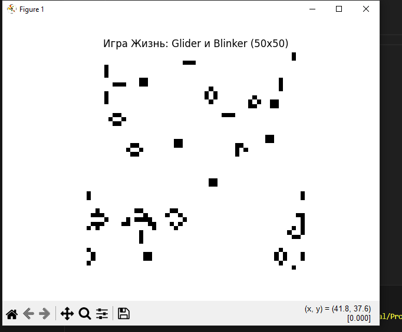

# Лабораторная работа 4

Дисциплина: Искусственный интеллект  
Тема: Моделирование клеточного автомата "Игра Жизнь"  

## Вариант 20 (по таблице 5-й вариант)

- Паттерн: Glider и Blinker  
- Размер сетки: 50×50  
- Начальное состояние: случайная генерация с вероятностью живой клетки от 20% до 50%  

## Цель работы

Научиться моделировать клеточный автомат, исследовать самоорганизацию и появление сложных структур, а также понять связь клеточных автоматов с искусственным интеллектом и многоагентными системами.

## Задание

Нужно:

- создать случайную двумерную сетку размера 50×50 с вероятностью появления живой клетки от 0.2 до 0.5  
- добавить на поле фиксированные паттерны Glider и Blinker  
- реализовать классические правила "Игры Жизнь" Джона Конвея:  
  - живая клетка с менее чем 2 живыми соседями умирает (одиночество)  
  - живая клетка с 2 или 3 живыми соседями остается живой  
  - живая клетка с более чем 3 соседями умирает (перенаселение)  
  - мертвая клетка с ровно 3 соседями становится живой  
- запустить симуляцию и визуализировать изменения на каждом шаге с помощью matplotlib  

## Теоретическая часть

"Игра Жизнь" - это клеточный автомат, предложенный Джоном Конвеем в 1970 году.  
Модель работает на двумерной решетке, где каждая клетка может быть живой или мертвой, а ее состояние на следующем шаге зависит только от числа живых соседей.

Несмотря на очень простые правила, система показывает сложное поведение:  
появляются устойчивые конфигурации, осцилляторы и движущиеся структуры вроде glider.  
Из-за этого "Игра Жизнь" часто рассматривается как пример возникновения сложности из простых локальных правил и используется в задачах моделирования многоагентных систем.

В этой лабораторной мы рассматриваем два классических паттерна:  
- Glider - маленькая самодвижущаяся структура, которая постепенно перемещается по полю  
- Blinker - осциллятор периода 2, который меняет ориентацию каждое поколение  

Оба паттерна помещаются на фоне случайной сетки, что позволяет посмотреть, как они взаимодействуют с хаотической средой.

## Практическая часть

### Среда моделирования

- Язык: Python 3.x  
- Библиотека визуализации: matplotlib  
- Размер сетки: 50×50  
- Паттерны: Glider и Blinker  
- Начальное состояние: случайное, с вероятностью 20%–50% живых клеток  

Перед запуском нужно установить библиотеку:

```bash
pip install matplotlib
```

### Код программы (game_of_life.py)

```csharp
import numpy as np
import matplotlib.pyplot as plt
import matplotlib.animation as animation
import random

# ===============================
# Параметры сетки
# ===============================
ROWS = 50
COLS = 50
PROBABILITY = random.uniform(0.2, 0.5)  # вероятность, что клетка живая в начале


# ===============================
# Создание случайной сетки
# ===============================
def create_random_grid(rows, cols):
    """Создаёт случайную матрицу 0/1 по заданной вероятности."""
    return np.random.choice(
        [0, 1],
        size=(rows, cols),
        p=[1 - PROBABILITY, PROBABILITY],
    )


# ===============================
# Добавление паттернов Glider и Blinker
# ===============================
def add_glider(grid, top, left):
    """Добавляет паттерн Glider на сетку начиная с позиции (top, left)."""
    glider = np.array(
        [
            [0, 1, 0],
            [0, 0, 1],
            [1, 1, 1],
        ]
    )
    grid[top : top + 3, left : left + 3] = glider


def add_blinker(grid, top, left):
    """Добавляет паттерн Blinker (вертикальный осциллятор)."""
    blinker = np.array(
        [
            [0, 1, 0],
            [0, 1, 0],
            [0, 1, 0],
        ]
    )
    grid[top : top + 3, left : left + 3] = blinker


# ===============================
# Правила игры Жизнь Конвея
# ===============================
def update(frame_num, img, grid):
    """Один шаг игры Жизнь."""
    new_grid = grid.copy()
    for i in range(ROWS):
        for j in range(COLS):
            # Считаем живых соседей (8 вокруг клетки)
            total = int(
                (
                    grid[i, (j - 1) % COLS]
                    + grid[i, (j + 1) % COLS]
                    + grid[(i - 1) % ROWS, j]
                    + grid[(i + 1) % ROWS, j]
                    + grid[(i - 1) % ROWS, (j - 1) % COLS]
                    + grid[(i - 1) % ROWS, (j + 1) % COLS]
                    + grid[(i + 1) % ROWS, (j - 1) % COLS]
                    + grid[(i + 1) % ROWS, (j + 1) % COLS]
                )
            )

            # Применяем правила Конвея
            if grid[i, j] == 1:
                if total < 2 or total > 3:
                    new_grid[i, j] = 0
            else:
                if total == 3:
                    new_grid[i, j] = 1

    img.set_data(new_grid)
    grid[:] = new_grid[:]
    return (img,)


# ===============================
# Инициализация
# ===============================
grid = create_random_grid(ROWS, COLS)

# Добавляем паттерны в разные места поля
add_glider(grid, top=1, left=1)
add_blinker(grid, top=20, left=30)

# ===============================
# Визуализация
# ===============================
fig, ax = plt.subplots()
img = ax.imshow(grid, interpolation="nearest", cmap="binary")
ax.set_title("Игра Жизнь: Glider и Blinker (50x50)")
ax.axis("off")

ani = animation.FuncAnimation(
    fig,
    update,
    fargs=(img, grid),
    frames=200,
    interval=150,
    blit=True,
)

plt.show()
```

## Результаты экспериментов

Были запущены несколько серий экспериментов с разными случайными начальными конфигурациями.  
Каждый новый запуск генерирует уникальную сетку, поэтому взаимодействие паттернов с фоном немного отличается.

Примеры наблюдений:

1. При стандартной случайной генерации glider свободно движется по сетке, пока не сталкивается с другими структурами.  
   Blinker стабильно осциллирует между горизонтальным и вертикальным состоянием.

2. При другой случайной конфигурации glider раньше сталкивается с плотной группой живых клеток, его форма рушится и на месте столкновения появляются новые устойчивые "островки".

3. При множественных запусках на поле остаются "тихие" зоны из стабильных фигур, а осцилляторы и движущиеся структуры продолжают эволюционировать вокруг них.

Скриншоты работы программы студент может добавить в отчет самостоятельно после запуска симуляции.

## Выводы

В этой лабораторной работе был реализован клеточный автомат "Игра Жизнь" Джона Конвея на языке Python с использованием библиотеки matplotlib.  
Были заданы классические правила эволюции клеток и добавлены паттерны Glider и Blinker на случайную сетку.  
Симуляция показала примеры самоорганизации, взаимодействие устойчивых структур с хаотической средой и поведение осцилляторов.  

Цель работы считаю достигнутой.


